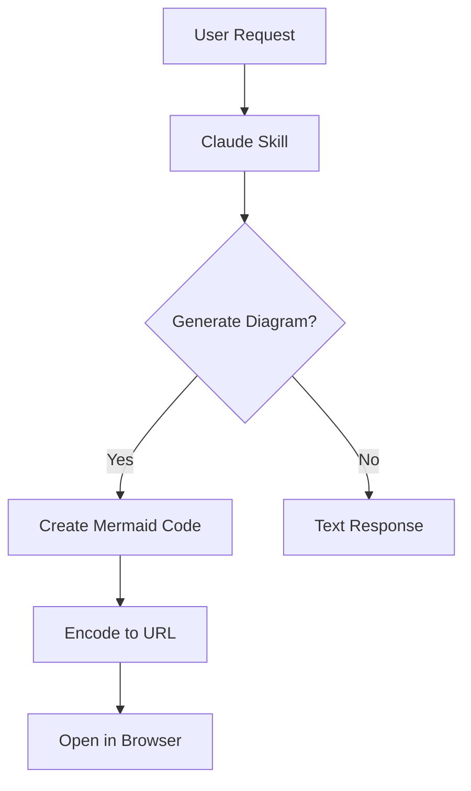

# Mermaid Diagram Viewer

A live Mermaid diagram editor and viewer powered by [beautiful-mermaid](https://github.com/lukilabs/beautiful-mermaid). Renders diagrams as beautiful SVGs with 15 built-in themes.

**Live**: https://junyiacademy.github.io/mermaid/

## Features

- Live preview as you type
- **SVG and ASCII output** — toggle between beautiful SVG diagrams and Unicode ASCII art
- **Infinite canvas** — drag to pan, scroll wheel to zoom (cursor-anchored)
- 15 themes from beautiful-mermaid with adaptive light/dark UI
- URL-based sharing — diagram is compressed and encoded in the URL hash
- **Notes panel** — embed text notes alongside diagrams using Mermaid comments
- Resizable and collapsible editor pane
- Mobile responsive
- No backend required — everything runs client-side

## Example

[Click here to see a live diagram with notes](https://junyiacademy.github.io/mermaid/#c=eJxVUdGO0zAQfO9XjHTKW_MLcDQtx-l6gEIrhKI-mHraWNfaweuqnDD_jmwnuuIXe3dmVzOeqsK9dYEyqyrc3eGTu-Ix4LvzL7lVYyv0EFotUPD8daEEBIfQE81JXTTx7cWcToW96QlJJTT3RlNw7Rl6-jRypKVXgVDQRh29OpehxwNeKXOYgL2nChQ805-V0dg7zTlo0y2JEBwUtu16DmU13ECb28ZmQT-9uwr9rKpGP098RePOg7O0ITuKbzUiWnciYu7Xb2d8x5F_4xIRX73bU4SCS_qa6UtG8iS8cZqIWBaf0DwYa4JxdiJu2zVW2ZcfNfmyNfmaDB-ch_TKG3ssc_e0ui6BzY5eDT02yxkAfOhyUG1Rs0Ndv8Oiu5W-y7xFRpo_D1MWo8L3fzPcJDj-oEQsuyaH8Z-lsmSZl6y6oj9lsm3XBVpl6GP3ZaBNqSxKIrub7Z9dxEO34e-AljI4K9z9A0q1yms) — a flowchart with notes panel showing how a Claude skill generates and opens a Mermaid diagram:



## Notes Panel

You can embed text notes (insights, data tables, observations) alongside your diagram. Notes are written as Mermaid comments between `@notes` and `@end-notes` markers:

```
%% @notes
%% ## Key Observations
%% - Data flows through 3 layers before reaching the API response
%% - Cache hit rate is critical for performance
%%
%% ## Data Sources
%% | Source | Type | Role |
%% |--------|------|------|
%% | Datastore | NoSQL | Source of Truth |
%% @end-notes

graph TD
    A[Request] --> B[Handler]
    B --> C[Database]
```

The viewer extracts the notes block, renders it as formatted text in a collapsible panel below the diagram, and passes the remaining code to the Mermaid renderer. Notes support basic markdown: headers (`##`), bullet lists (`-`), bold (`**text**`), inline code (`` `code` ``), tables, and code blocks.

## Sharing Diagrams

The Mermaid source is zlib-compressed and base64url-encoded into the URL hash. Open a shared link and the diagram renders immediately.

### Generate a share URL programmatically

**Node.js:**

```js
const zlib = require('zlib')

function encodeMermaid(code) {
  const compressed = zlib.deflateSync(code)
  const base64 = compressed.toString('base64')
    .replace(/\+/g, '-')
    .replace(/\//g, '_')
    .replace(/=+$/, '')
  return `https://junyiacademy.github.io/mermaid/#c=${base64}`
}
```

**Python:**

```python
import zlib, base64

def encode_mermaid(code: str) -> str:
    compressed = zlib.compress(code.encode())
    b64 = base64.urlsafe_b64encode(compressed).rstrip(b"=").decode()
    return f"https://junyiacademy.github.io/mermaid/#c={b64}"
```

### Open from terminal (macOS)

```bash
open "https://junyiacademy.github.io/mermaid/#c=<encoded>"
```

## Development

```bash
npm install
npm run dev
```

## License

MIT
