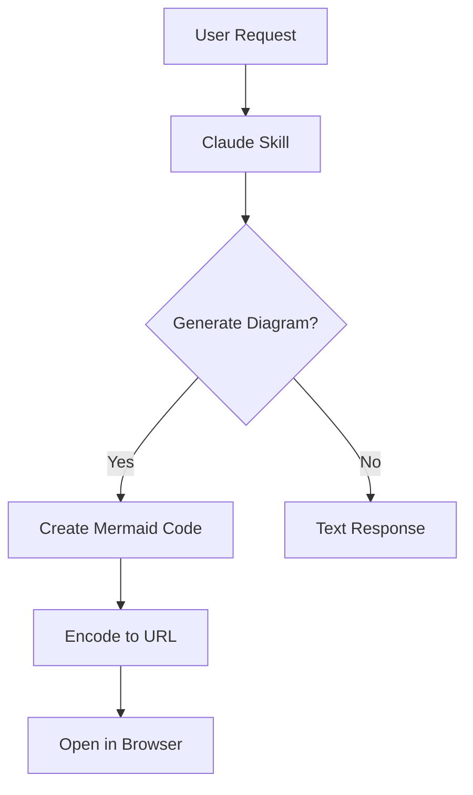

# Mermaid Diagram Viewer

A live Mermaid diagram editor and viewer powered by [beautiful-mermaid](https://github.com/lukilabs/beautiful-mermaid). Renders diagrams as beautiful SVGs with 15 built-in themes.

**Live**: https://junyiacademy.github.io/mermaid/

## Features

- Live preview as you type
- 15 built-in themes (Tokyo Night, Catppuccin, Nord, Dracula, etc.)
- URL-based sharing — diagram is compressed and encoded in the URL hash
- No backend required — everything runs client-side

## Example

[Click here to see a live diagram](https://junyiacademy.github.io/mermaid/#c=eJxNjk0OgjAYRPee4rsAV9BIi2z8SRAWpumikQk2QottiSbi3S114yznTV6mc2q8Uc1XFLMVjYejCo8JPkjKsjXlgvVqakHnu-57mXZ5IuxdwsCpAOJadU4Nm0_CbMHzBX4mLpjDsjjADUq3xGyLn4QnSSEKc40dBUtNtf-hIqGdOI0wpA3lzj7jMflnP9qZSlHjFeJdP1rjIb8fyzyR) — a flowchart showing how a Claude skill generates and opens a Mermaid diagram:



## Sharing Diagrams

The Mermaid source is compressed (pako deflate) and base64url-encoded into the URL hash. Open a shared link and the diagram renders immediately.

### Generate a share URL programmatically

```js
const pako = require('pako')

function encodeMermaid(code) {
  const compressed = pako.deflate(new TextEncoder().encode(code))
  const base64 = btoa(String.fromCharCode(...compressed))
    .replace(/\+/g, '-')
    .replace(/\//g, '_')
    .replace(/=+$/, '')
  return `https://junyiacademy.github.io/mermaid/#c=${base64}`
}
```

### Open from terminal (macOS)

```bash
open "https://junyiacademy.github.io/mermaid/#c=<encoded>"
```

## Development

```bash
npm install
npm run dev
```

## License

MIT
